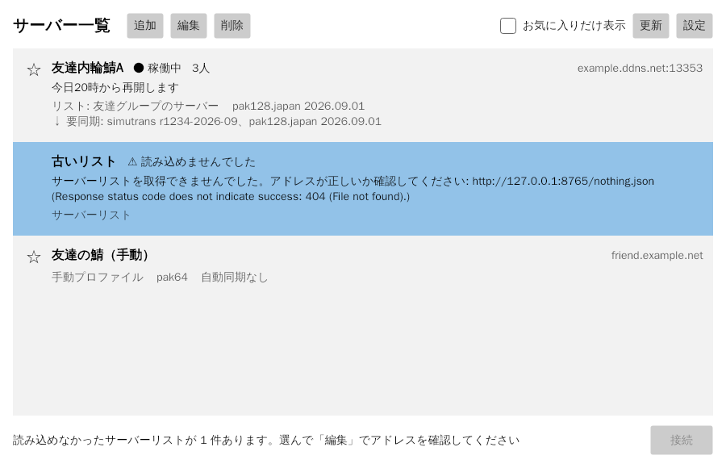

# Simutransインフラ整備ランチャー

Simutransのマルチプレイ運用を楽にするための外部ツールです。
Simutrans本体とは独立しており、本体のソースやビルド（Makefile、CMakeLists.txt、Visual Studioのプロジェクト）には含まれません。本体のコードも変更しません。



## やりたいこと

このツールは3つのことを目指しています。1つ目はpaksetの自動同期で、サーバーと同じpaksetと本体を自動でダウンロードします。2つ目はサーバーランチャーです。稼働状況やお知らせを一覧で見て、選ぶだけで同期から接続までを済ませられます。3つ目はサーバー構築の自動化で、Windows Serverでの配信サーバーの構築はPowerShellのスクリプトに任せられます。

詳しくは[設計メモ](docs/design-spec.md)を見てください。

## フォルダ構成

| フォルダ | 中身 |
|---|---|
| `docs/` | 設計メモなどのドキュメント |
| `manifest/` | サーバー一覧マニフェストの形式（JSON Schema）とサンプル。[説明](manifest/README.md) |
| `launcher/` | ランチャー本体（C#、.NET 10、Avalonia） |
| `server-setup/` | サーバー側のPowerShellスクリプト（配信サーバーの構築、HTTPS化、paksetと本体の公開）。[説明](server-setup/README.md) |

`launcher/`の中は次の4つのプロジェクトに分かれています。

| プロジェクト | 役割 |
|---|---|
| `src/InfraLauncher.Core` | マニフェストの読み込み、同期、起動コマンドの組み立て（画面に依存しない） |
| `src/InfraLauncher.App` | 画面（Avalonia） |
| `src/InfraLauncher.Cli` | コマンドライン版（動作確認とトラブル調査用） |
| `tests/InfraLauncher.Core.Tests` | Coreのテスト（xUnit） |

## ビルドと実行

ビルドには[.NET 10 SDK](https://dotnet.microsoft.com/download)が必要です。

```sh
cd tools/infra-launcher/launcher
dotnet build
dotnet test

# 画面版
dotnet run --project src/InfraLauncher.App

# コマンドライン版
dotnet run --project src/InfraLauncher.Cli -- list   https://example.ddns.net/manifest.json
dotnet run --project src/InfraLauncher.Cli -- sync   https://example.ddns.net/manifest.json friends-a
dotnet run --project src/InfraLauncher.Cli -- launch https://example.ddns.net/manifest.json friends-a --print-only --code A1B2-C3D4-E5F6-0718-293A
```

友人に配る実行ファイルは、次のコマンドで作ります。.NETを入れていないPCでも動きます。

```sh
dotnet publish src/InfraLauncher.App -c Release -r win-x64 --self-contained \
  -p:PublishSingleFile=true -p:IncludeNativeLibrariesForSelfExtract=true \
  -p:EnableCompressionInSingleFile=true -p:PublishTrimmed=true -p:DebugType=none -o publish
```

できあがるのは`publish/InfraLauncher.exe`（約21MB）の1ファイルです。`PublishTrimmed`で使わないコードを削って小さくしています。CoreのJSON処理はこの削り方に対応するためにソース生成を使っています。JSONで読み書きする型を増やしたときは、`Json.cs`の`JsonContext`にも追加してください。

## 使い方

画面では、マニフェストのことを「サーバーリスト」と呼んでいます。サーバー一覧は「追加」「編集」「削除」のボタンで管理します。

「追加」の選び方は2種類です。「サーバー管理者から共有されたリストを追加」は、管理者から教わった配信アドレス（`https://…/manifest.json`など）を入れる方法です。リストにあるサーバーがまとめて表示され、paksetや本体は自動で同期されます。「プロファイルを手動で設定」は、接続先のアドレス、paksetのフォルダ、simutrans本体を自分で指定する方法で、自動同期はしません。

共有されたリストを追加するときは、確認コード（`A1B2-C3D4-E5F6-0718-293A`のような文字列）の入力を求められます。サーバー管理者から聞いたコードを入れて「確認して登録」を押してください。ランチャーは確認コードを画面に表示しません。見比べずに進めたり、表示を写したりできないようにするためです。登録したあとは、サーバーリストが管理者のものかどうかを読み込むたびに確かめ、合わなければ読み込みを止めます。simutrans本体を入れるのは、確認コードを登録したリストからだけです。登録しなくてもpaksetは同期でき、あとから「編集」で登録することもできます。

「編集」と「削除」は、一覧で選んだものに対して働きます。共有されたリストのサーバーは中身を管理者が管理しているので、編集で変えられるのはリストの表示名と配信アドレスだけです。削除するとリストごと消えます。名前の左にある星のボタンはお気に入りの印で、印を付けたサーバーは一覧の上に並びます。「お気に入りだけ表示」で絞り込むことも可能です。

一覧では、サーバーの稼働状況と同期の状態を色付きの札で表示します。稼働状況は、ランチャーがサーバーのポートに実際につないで確かめた結果です。1分ごとに自動で確かめ直します。札の横の「再確認」を押すと、その場で確かめ直せます。「アップデートチェック」を押すと、サーバーリストを取り直して、同期で何を落とすことになるかを調べます。このときダウンロードや書き換えはしません。調べている間は、下の進み具合のバーと何%まで調べたかを表示します。

「同期」を押すと、本体とpaksetをサーバーと同じ状態にします。同期では何も実行しません。「起動」を押すとsimutransを起動してサーバーに接続します。ランチャーが入れた本体を初めて起動するときは、配布元と場所とSHA256を表示して確認を求めます。

「インストール設定」は、本体を配っているサーバーごとに、ダウンロード先のフォルダと本体のファイル構成を決める画面です。初めて「同期」を押したときにも表示されます。ダウンロード先には、`C:\Games\simutrans`のようにCドライブの直下に作ったフォルダをおすすめします。OneDriveなどの同期フォルダの中を選ぶと注意を表示します。ファイル構成は、サーバー管理者のおすすめどおりの「推奨」と、音楽やテーマなどの部品を自分で選ぶ「カスタム」から選べます。必須の部品は外せません。paksetはサーバーと完全に同じでないと接続できないため、選択肢はなく、すべてダウンロードします。

ダウンロード先を変えると、ランチャーは前のフォルダを使わなくなります。そのとき、前のフォルダにあるランチャーが入れたファイルを消すかどうかの確認が出ます。セーブデータなど自分で置いたファイルは消しません。それでも、残したいセーブデータは念のため別の場所へコピーしておいてください。

「設定」では、プレイヤー名、ダウンロード先の既定のフォルダ、手元のsimutrans本体を指定します。プレイヤー名は、サーバーに入ったときにほかのプレイヤーに表示される名前です。simutransには名前を渡す起動オプションがないため、ランチャーは起動するたびに本体の`config/simuconf.tab`の先頭へ名前を書き込みます。手元のsimutrans本体は、共有されたリストにこのPC用の本体が含まれていないときに使います。

## 動き

一覧の元になるのは、共有されたサーバーリストと、隣にある署名（`manifest.sig.json`）です。確認コードを登録したリストは、その鍵の正しい署名がなければ読み込みません。

「同期」では、足りないものだけをダウンロードし、SHA256を確かめてから置きます。zip方式では、本体とpaksetのzipのSHA256を記録（`installed.json`）と比べ、違えばzipを丸ごと入れ替えます。ファイル一覧方式では、ファイルを1つずつ一覧と照合し、変わったファイルだけを落とします。一覧にないpaksetのファイルは片付けの対象です。手元のほかのフォルダに同じ中身のファイルがあれば、ダウンロードせずにコピーして使います。

本体の`config/simuconf.tab`だけは扱いが違います。このファイルはユーザーが書き換えたり、ランチャーがプレイヤー名を書き込んだりするため、手元になければ入れますが、あれば書き換えません。サーバー側で新しくなったものに入れ替えたいときは、手元のファイルを消してから同期してください。

本体は、サーバーリストに本体があり、確認コードを登録した鍵で署名を確かめられたときだけ入れます。データが30秒届かなければ通信を打ち切り、通信が途切れたときは3回まで試します。

「起動」では`simutrans -objects <pak>/ -noaddons -load net:<host>:<port>`で起動して接続します。手動プロファイルでは同期を飛ばします。承認した本体はSHA256で覚え、本体が変わると改めて確認を求めます。インストールしたあとに本体のexeが書き換えられていたら、起動せずに同期で入れ直します。

ランチャーのデータは`%LOCALAPPDATA%\InfraLauncher`に置きます。Linuxでは`~/.local/share/InfraLauncher`です。

| ファイル・フォルダ | 中身 |
|---|---|
| `settings.json` | 設定（サーバーリスト、手動プロファイル、お気に入り、プレイヤー名） |
| `installed.json` | 入れたものの記録 |
| `simutrans/<revision>/` | 本体とpaksetの既定のダウンロード先 |
| `downloads/partial/` | ダウンロード途中のファイル（終われば消す。14日使わなければ消す） |
| `indexes/` | 取得したファイル一覧の控え |
| `logs/sync.log` | 同期の記録。止まったり失敗したりしたときに調べるために使う |

ユーザーが自分で入れたpaksetのフォルダを置き換えるときは、消さずに`<フォルダ名>.backup-<日時>`という名前に変えて残します。
